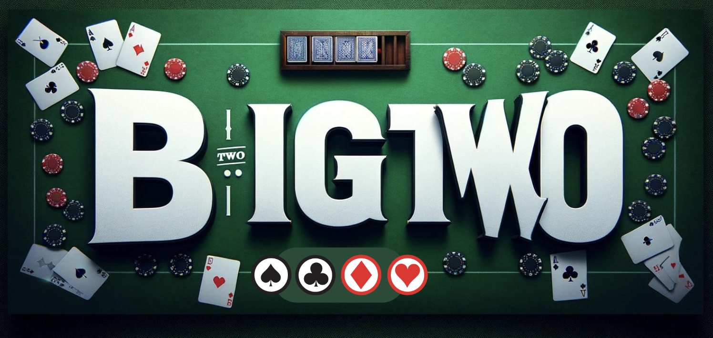

# Big Two Card Game (G1T6)

---

## Team Members:

- Neha D/O Ram Singasan
- Loo Zhi Yi
- Chua Kia Ying
- Tori Ng
- Pua Jin Chong Ian
- Lim Jun Shyann

---

## Project Description:

In this project, we've created a digital version of the beloved card game, Big Two, which supports four-player gameplay. The goal is simple: be the very first to get rid of all your cards. Utilizing Java Swing, we've developed an intuitive graphical user interface (GUI) that brings the excitement of Big Two to your screen.

---

## Game rules:

Objective: 
Be the first player to discard all your cards.

Players: 
The game can be played by 4 players.

Dealing Cards: 
Each player is dealt 13 cards.

Card Ranking (Low to High):
3, 4, 5, 6, 7, 8, 9, 10, J, Q, K, A, 2

Suit Ranking (Low to High):
Diamonds, Clubs, Hearts, Spades  

### Gameplay:

1. Dealing: The dealer shuffles and deals 13 cards face to each player.

2. Starting the Play: The player with the 3 of diamonds begins the game by playing a valid card combination (detailed below), which must include the 3 of diamonds.

3. Playing a Round: Players take turns clockwise, trying to play a higher-valued combination than the one played before. Here are the playable combinations:

- Single Card: One card, higher than the previous single
- Pair: Two cards of the same rank (e.g., two 10s)
- Straight: Five consecutive cards of any suit (e.g., 3, 4, 5, 6, 7 of mixed suits)
- Flush: Five cards of the same suit (e.g., all Diamonds). 
 -Full House: Three cards of the same rank and a pair (e.g., three Jacks and two 5s).
- Quads (Four of a kind): Four cards of the same rank (e.g., four Queens).
- Straight Flush: Five consecutive cards of the same suit (e.g., 10, J, Q, K, A of Hearts).

4. Passing: If a player cannot play a higher-valued combination, they can choose to "pass".

5. The "3 Pass" Rule:  If three consecutive players pass, the last player who played a valid combination gains control. They can start a new round by playing any valid combination of their choice.

6. Winning the Round: The first player to discard all their cards wins the round.  

---

## Setup and Running

### Prerequisites

Ensure you have Java and JDK installed on your system.

### Compiling the Game

Navigate to the project directory and run the `compile.bat` script:

### Running the Game

After compilation, start the game using the `run.bat` script

---
