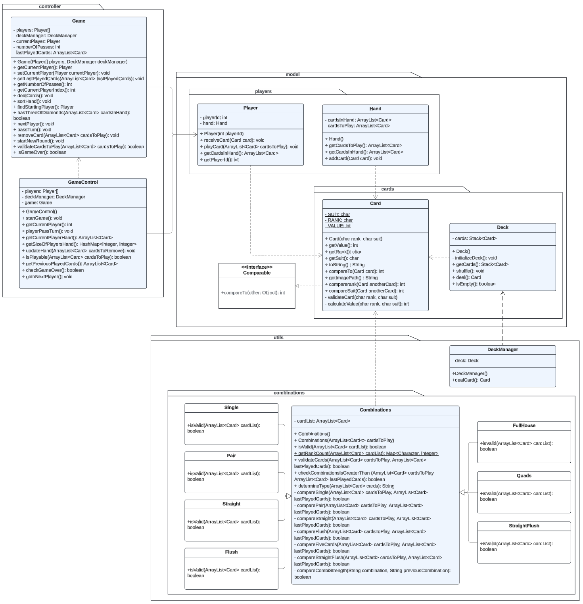

# Big Two Card Game (G1T6)

---

## Team Members:

- Neha D/O Ram Singasan
- Loo Zhi Yi
- Chua Kia Ying
- Tori Ng
- Pua Jin Chong Ian
- Lim Jun Shyann

---

## Project Description:

In this project, we've created a digital version of the beloved card game, Big Two, which supports four-player gameplay. The goal is simple: be the very first to get rid of all your cards. Utilizing Java Swing, we've developed an intuitive graphical user interface (GUI) that brings the excitement of Big Two to your screen.

---

## Game rules:

**Objective:**  
Be the first player to discard all your cards.

**Players:**  
The game can be played by 4 players.

**Dealing Cards:**  
Each player is dealt 13 cards.

**Card Ranking (Low to High):**  
3, 4, 5, 6, 7, 8, 9, 10, J, Q, K, A, 2

**Suit Ranking (Low to High):**  
Diamonds, Clubs, Hearts, Spades  

### Gameplay:

1. **Dealing:**
The dealer shuffles and deals 13 cards to each player.

2. **Starting the Play:** 
The game begins with the player holding the 3 of Diamonds, who must include this card in their initial play with a valid card combination

3. **Playing a Round:** 
    - Play proceeds clockwise
    - Plays must either play a higher-ranking card combination than the previous player or pass
    - The number of cards played each round is dependent on the number of cards played by the previous player (either 1, 2, or 5 cards) and must be higher ranked than the previously played cards

4. **Card Combinations:**
    - **Single Card:** One card to be played. The single card play must outrank the previously played card. If cards are of the same rank, the suit determines the stronger card, following the suit order.

    - **Pair:** This involves two cards of identical rank. Cards will be compared by their ranks first. When comparing pairs of the same rank, the higher suit in one of the cards makes the pair stronger. For example, a pair including a Spade is stronger than the same pair without a Spade.

    - **Straight:** A sequence of five cards regardless of suit. They are first compared using their overall range If one Straight starts with a higher card than the other (e.g. 6-7-8-9-10 vs. 5-6-7-8-9), it is considered stronger because its range begins higher. If both Straights have the same range, then the highest card in each Straight is compared to determine the strong Straight.

    - **Flush:** Five cards of the same suit, not necessarily in sequential order. The first criterion for comparing two Flushes is their suit, where a flush in a higher-ranking suit is automatically stronger than one in a lower-ranked suit. If two Flushes are of the same suit, their strength is then compared based on the highest card in each Flush.

    - **Full House:** Combination of five cards consisting of a Three-of-a-Kind and a Pair.The primary factor for comparing is the rank of the Three-of-a-Kind. The Full House with the higher-ranking Three-of-a-Kind is considered stronger. 

    - **Quads (Four of a kind):** Four cards of the same rank accompanied by any fifth card to be played. The strength of Quads is compared based on the rank of the four identical cards. 

    - **Straight Flush:** Consists of five cards in sequential order, all of the same suit. The order of comparison is the same as comparing two Straights.If the range of the two straight flushes are the same, we compare the strength of the flushes.

5. **Passing:**  
If a player cannot play a higher-valued combination, they can choose to "pass".

6. **The "3 Pass" Rule:**  
If three consecutive players pass, the last player who played a valid combination gains control of the board. They can start a new round by playing any valid combination of their choice.

7. **Winning the Round:**  
The first player to discard all their cards wins the round.

---

## Setup and Running

### Prerequisites

Ensure you have Java and JDK installed on your system.

### Compiling the Game

Navigate to the project directory and run the `compile.bat` script:

### Running the Game

After compilation, start the game using the `run.bat` script

---

## UML Diagram

